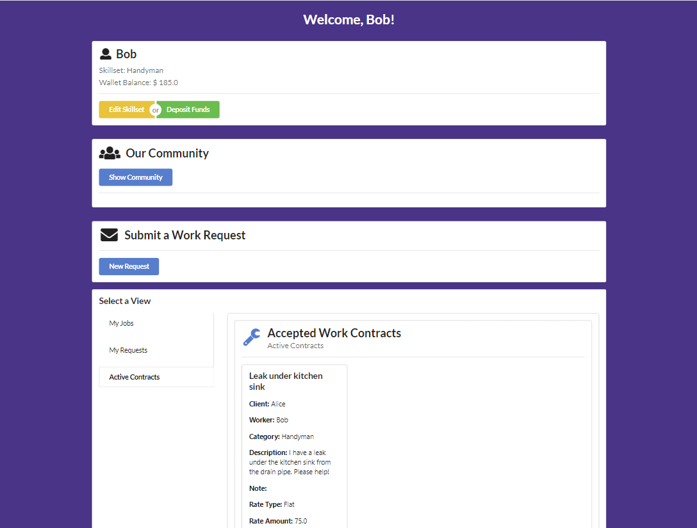

# Community Helper<br>

  ## Description
  ***Note:  This is a Work in Process***
  Community Helper is an application built with React, DAML, & TypeScript. This application matches neighbors with skills with neighbors in need. Utilizes smart contracts for work proposals/contracts.

  Deposit Funds to your wallet, Edit your skillset, View Other community Members or submit a work proposal via a form.  Once a work proposal is submitted, the worker can either accept or reject the proposal.  If accepted, the proposal becomes a contract.  If rejected, the proposal can either be edited to more acceptable terms or canceled.

  ### Screenshot of app
  
  
  ## Table of Contents
  
  - [Installation](#installation)
  - [Usage](#usage)
  - [License](#license)
  - [Contributing](#contributing)
  - [Tests](#tests)
  - [Questions](#questions)
  
  ## Installation
  
  From the command line, run:
   ```
   npm install
   daml start
   cd ui
   npm start
   ```
  
  ## Usage
  
  log in as any one of the following: `alice`, `bob`, `charlie`, `debbie`, `ernie`, `fiona`, or `george`.  These are preset members of the community.  No password required.

  ## License
This application is covered under the MIT License.
<br>For more information: https://opensource.org/licenses/MIT
  
  ## Contributing
  N/A
  
  ## Tests
  N/A

  ## Questions
  Contact Info<br>
  GitHub user name: BillStephens2022<br>
  Link to GitHub profile: https://github.com/BillStephens2022<br>
  Email: stephensbill17@gmail.com
